# DMATHS Learning Hub — Entity Relationship Diagram

A high-level ER diagram of the core domain. Rendered with Mermaid (GitHub renders
this natively). See `supabase/migrations/0001_schema.sql` for the authoritative,
column-level definitions.

```mermaid
erDiagram
    auth_users ||--|| profiles : "1:1 (trigger)"
    profiles ||--o| instructor_profiles : "extends"
    profiles ||--o{ courses : "instructs"
    categories ||--o{ courses : "groups"

    courses ||--o{ sections : "has"
    sections ||--o{ lessons : "has"
    lessons ||--o{ lesson_resources : "has"
    courses ||--o{ course_objectives : "has"
    courses ||--o{ course_requirements : "has"

    profiles ||--o{ enrollments : "enrolls"
    courses ||--o{ enrollments : "has"
    profiles ||--o{ lesson_progress : "tracks"
    lessons ||--o{ lesson_progress : "tracked by"
    profiles ||--o{ notes : "writes"
    profiles ||--o{ bookmarks : "saves"
    profiles ||--o{ wishlists : "wishes"

    courses ||--o{ quizzes : "has"
    quizzes ||--o{ questions : "has"
    questions ||--o{ question_options : "has"
    quizzes ||--o{ quiz_attempts : "attempted in"
    quiz_attempts ||--o{ quiz_answers : "records"
    courses ||--o{ assignments : "has"
    assignments ||--o{ assignment_submissions : "receives"

    profiles ||--o{ certificates : "earns"
    courses ||--o{ certificates : "certifies"

    profiles ||--o{ orders : "places"
    orders ||--o{ order_items : "contains"
    orders ||--o{ payments : "paid by"
    orders ||--o| invoices : "invoiced"
    coupons ||--o{ orders : "discounts"
    bundles ||--o{ bundle_courses : "includes"

    courses ||--o{ reviews : "reviewed"
    courses ||--o{ discussions : "discussed"
    discussions ||--o{ comments : "threads"
    profiles ||--o{ messages : "sends"
    profiles ||--o{ notifications : "receives"

    profiles ||--o{ xp_events : "earns"
    badges ||--o{ user_badges : "awarded"
    profiles ||--o| streaks : "has"

    profiles ||--o{ blog_posts : "authors"
    blog_posts ||--o{ blog_comments : "has"
    profiles ||--o{ support_tickets : "opens"
```

## Design notes

- **Denormalized aggregates** on `courses` (`rating_avg`, `student_count`,
  `lesson_count`, `duration_minutes`) are maintained by triggers
  (`0002_functions.sql`) so catalog reads never join/aggregate at request time.
- **`content jsonb`** on `lessons` is polymorphic per `lesson_type` — a video
  source `{provider, ref}`, markdown body, embed URL, etc. — keeping the schema
  stable as new lesson types are added.
- **Certificates** carry a unique `certificate_number` plus an opaque
  `verification_token` embedded in the QR code; public verification goes through
  the `verify_certificate(token)` SECURITY DEFINER RPC, never direct table reads.
- **RLS** governs every table (`0003_policies.sql`); the app relies on it as the
  primary authorization boundary, with middleware role-gating as defense-in-depth.
